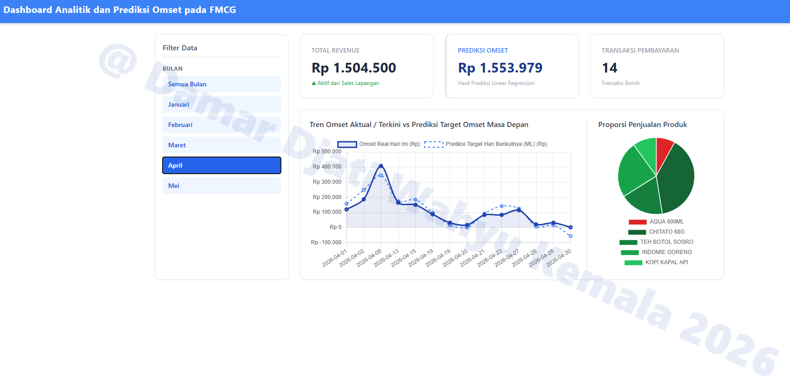
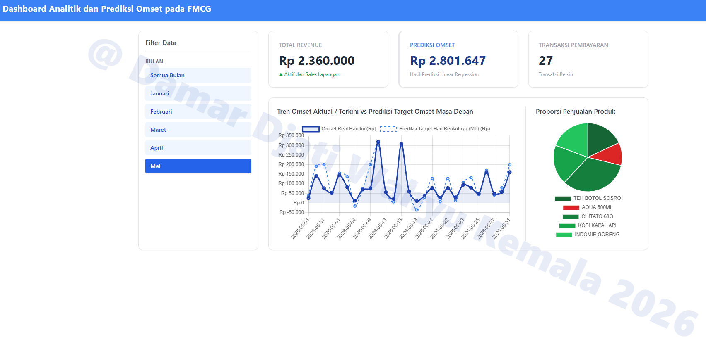

<div align="center">
  <h3>DATA ANALYST & BUSINESS ANALYST PORTFOLIO</h3>
  <h2>Dashboard Analitik dan Prediksi Omset pada FMCG</h2>
  <p><b>Created by:</b> Damar Djati Wahyu Kemala | <b>Role:</b> Aspiring Data & Business Analyst (Ex-SIMRS Developer)</p>
  <p><i>© 2026 Damar Djati Wahyu Kemala</i></p>
  <hr />
</div>


# Prologue

Melengkapi terkait project kemarin bernama `Omset Analysis dan ML Prediction Dashboard` pada repo `Linear-Regression-Sistem-Prediksi-Harga-Penjualan-Barang`, dan saya menyertakan beberapa tambahan data (pengumpulan data independen) / custom data. dengan total 100 data, dan schema table yang berbeda dari sebelumnya karena pada analisis ini ada tambahan kolom seperti,

1. `Kuantitas`
2. `total_Pembayaran`
3. `Nama Produk`

Data FMCG ini yang dapat kita jumpai dan konsumsi sehari-hari seperti, kopi, mie goreng, dan lainnya.

---

## Fitur
* **ML Forecasting:** Prediksi otomatis omset menggunakan Python (*Linear Regression / Machine Learning*).
* **Star Schema Data Warehouse:** Penyimpanan data menggunakan SQL Server dengan **staging table dan clean table**.
* **High-Performance Backend:** REST API yang dibangun menggunakan bahasa **Go (Golang)**.
* **Interactive BI Dashboard:** Visualisasi predict dan aktual data menggunakan **Chart.js** dan pie chart untuk melihat proporsi penjualan produk.

---

## Tech Stack


* **Database:** Microsoft SQL Server
* **AI/Data Science:** Python 3 (Pandas, Scikit-Learn, `pyodbc`/`pymssql`)
* **Backend API:** Go 1.20+ (Driver: `github.com/microsoft/go-mssqldb`)
* **Frontend:** HTML5, CSS3 (Flexbox Layout), dan Chart.js

---

## Struktur Project

```text
Dashboard-Analitik-dan-Prediksi-Omset-pada-FMCG
├── go_backend/
│    ├── go.mod
│    ├── go.sum
│    └── main.go
├── python_inference_cron/
│    ├── clean_data.ipynb
│    ├── predict_cron.py
│    └── requirement.txt
├── script/
│    └── script.js
├── style/
│    └── custom.css
├── .env
├── .gitignore
├── AnalitikFMCG_DB-data.sql
├── Hasil-Dashboard-1.png
├── Hasil-Dashboard-2.png
├── Hasil-Dashboard-3.png
├── Hasil-Dashboard-4.png
├── Hasil-Dashboard-5.png
├── Hasil-Dashboard-6.png
├── Hasil-Dashboard-7.png
├── Hasil-Dashboard-8.png
├── index.html
└── README.md
```
---

## Metode STAR
Yang dapat saya peroleh selama saya bekerja sebagai developer sekaligus sebagai reporting dashboard pada SIMRS,
dapat dijumpai sepanjang hari terkait data yang kotor, dengan format yang perlu kita susun ulang untuk memperoleh insight, kesimpulan sebuah data, keputusan pada data, dan untuk membuat real-time dashboard agar dapat diakses sepanjang hari oleh user.
dan dari experimen yang salah lakukan pada project ini didasari oleh:

1. Situation: Banyak data di lapangan yang masuk dalam kondisi kotor (typo, null, duplikat).

2. Task: Wajib membuat sistem otomatis yang bisa membersihkan data sekaligus memprediksi omset esok hari.

3. Action: Saya mencoba membangun pipeline otomatis dengan Python Pandas dan ML, disimpan di SQL Server, dikirim via API Go, dan divisualisasikan dengan Chart.js.

4. Result: Dari sisi cross-management di perusahaan  bisa melihat tren real-time dan langsung tahu produk / case subject dengan performa terendah berkat indikator warna dinamis.

Dan data yang saya gunakan adalah custom data (independent data) yang saya kumpulan sendiri dan custom sendiri untuk experimen.

---

## Tambahan untuk Corn Job

Pada project ini saya belum menambahkan terkait proses corn-nya.
Langkahnya kurang lebih seperti ini:

1. Buat file didalam folder root `run_pipeline.bat`
2. Isi dengan kode berikut
    ```code
        @echo off
        cd /d "%~dp0python_inference_cron"
        python cron_predict.py
        exit
    ```
3. Cari `Task Scheduler` di windows (kebetulan saya pakai windows 11)
4. Di panel bagian kanan (Actions), klik Create Basic Task
5. Pada Name, Isi dengan nama, contoh: FMCG_Data_Cleaning.
6. Pada Description: (Opsional) Isi dengan deskripsi proyek, contoh: Script untuk membersihkan custom data dan update model prediksi harian.
7. Klik Next.
8. Pada pilihan Task Trigger, pilih Daily (Harian). Pilih ini sebagai trigger awal sebelum diubah menjadi per 5 menit.
9. Klik Next
10. Lalu Atur pada bagian waktu mulai (Start time) bebas (set saja default), lalu klik Next.
11. Pada pilihan Action, pilih Start a program
12. Klik Next
13. Pada kolom Program/script, klik tombol Browse, dan cari file run_pipeline.bat.
14. Pada kolom Start in (optional), masukkan alamat path absolut folder root (contoh: C:\Users\nama\Documents\project). supaya Git dan .env terbaca.
15. Klik Next, lalu klik Finish

Cara Uji

1. Ke Task Scheduler
2. Klik dua kali (Double-click) pada nama tugas tersebut untuk membuka jendela Properties.
3. Masuk ke tab Triggers, lalu klik tombol Edit
4. Advanced settings
5. Centang kotak Repeat task every, lalu ketik atau pilih 5 minutes
6. Pada pilihan for a duration of, ubah atau ketik menjadi Indefinitely (berjalan secara terus menerus)
7. Klik OK pada jendela Edit, dan klik OK sekali lagi pada jendela Properties


---

## View Dashboard

<div align="center">
    <div style="margin-bottom: 40px; max-width: 800px;">
        
        <p style="margin-top: 10px;"><b>1. Tampilan Utama Dashboard</b></p>
        <hr size="1" color="#e5e7eb">
    </div>
    <div style="margin-bottom: 40px; max-width: 800px;">
        
        <p style="margin-top: 10px;"><b>2. Menampilkan Tren Penjualan pada Bulan Januari baik di setiap hari-nya pada Line Chart dan proporsi grand total omset penjualan produk yang ditunjukan pada Pie Chart.</b></p>
        <hr size="1" color="#e5e7eb">
    </div>
    <div style="margin-bottom: 40px; max-width: 800px;">
        
        <p style="margin-top: 10px;"><b>3. Pada Tanggal 24 Februari 2026 Terdapat Prediksi Harga yang diperoleh dari ML (Linear Regression) omset yang akan diperoleh hari besuknya sebesar Rp. 196.132</b></p>
        <hr size="1" color="#e5e7eb">
    </div>
    <div style="margin-bottom: 40px; max-width: 800px;">
        
        <p style="margin-top: 10px;"><b>4. Pada Tanggal 24 Februari 2026 secara aktual-nya pada hari itu omset yang diperoleh hanya sebesar Rp. 144.000</b></p>
        <hr size="1" color="#e5e7eb">
    </div>
    <div style="margin-bottom: 40px; max-width: 800px;">
        
        <p style="margin-top: 10px;"><b>5. Menampilkan produk aqua 600ml pada bulan maret mengalami omset penjualan paling rendah dari 4 produk hanya memiliki pendapatan / omset Rp. 75.000 (Secara Grand Total)</b></p>
        <hr size="1" color="#e5e7eb">
    </div>
    <div style="margin-bottom: 20px; max-width: 800px;">
        
        <p style="margin-top: 10px;"><b>6. Menampilkan proporsi penjualan Chitato 68G bulan Maret paling banyak dari 4 produk lainnya sebanyak Rp. 880.000 (Secara Grand Total)</b></p>
    </div>
    <div style="margin-bottom: 20px; max-width: 800px;">
        
        <p style="margin-top: 10px;"><b>7. Menampilkan Tren Penjualan pada Bulan April baik di setiap hari-nya pada Line Chart dan proporsi grand total omset penjualan produk yang ditunjukan pada Pie Chart.</b></p>
    </div>
    <div style="margin-bottom: 20px; max-width: 800px;">
        
        <p style="margin-top: 10px;"><b>8. Menampilkan Tren Penjualan pada Bulan Mei baik di setiap hari-nya pada Line Chart dan proporsi grand total omset penjualan produk yang ditunjukan pada Pie Chart.</b></p>
    </div>
</div>

---

## Copyright Personal Portfolio
* **Project Owner / Created By:** Damar Djati Wahyu Kemala
* **Role:** Aspiring Data Analyst & Business Analyst (Ex-SIMRS Developer)
* **Date Created:** Juni 2026
* **GitHub Portfolio:** [https://github.com/dams-code](https://github.com/dams-code)

---
*© 2026 Damar Djati Wahyu Kemala. This project is a part of my professional data analyst portfolio. Authorization is required for commercial use or modification.*