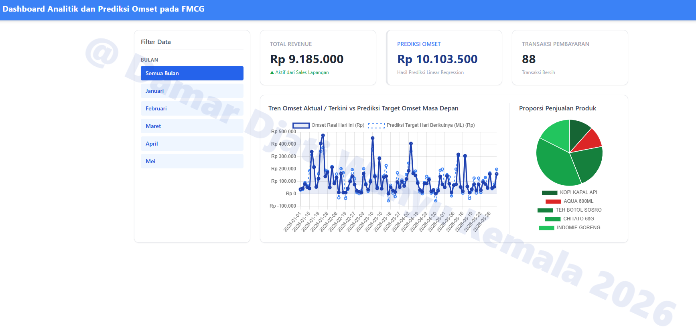
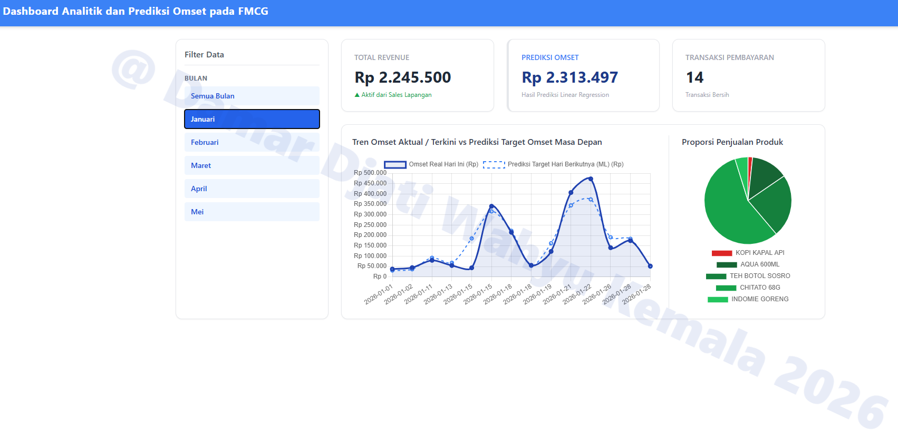
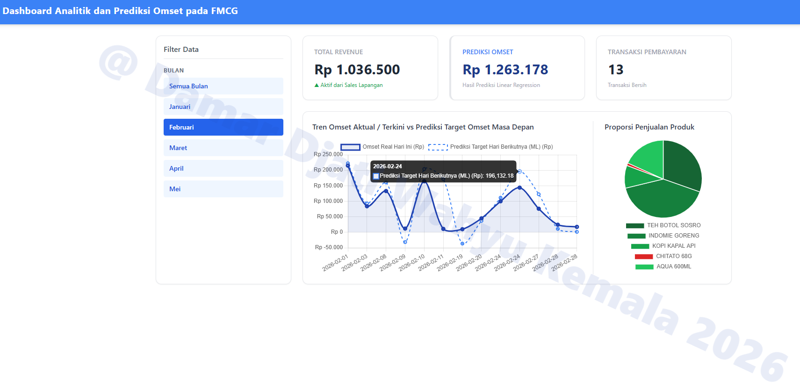
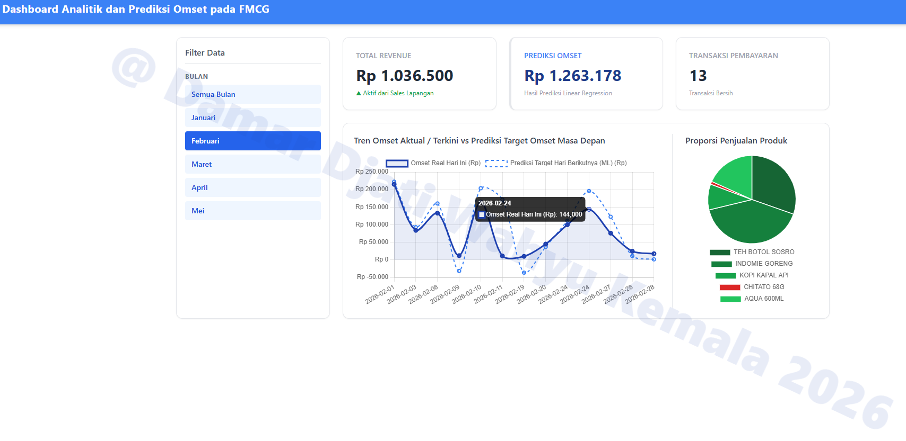
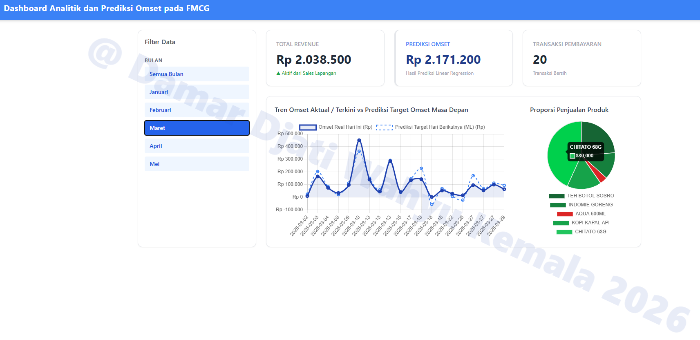

<div align="center">
  <h3>DATA ANALYST & BUSINESS ANALYST PORTFOLIO</h3>
  <h2>Dashboard Analitik dan Prediksi Omset pada FMCG</h2>
  <p><b>Created by:</b> Damar Djati Wahyu Kemala | <b>Role:</b> Aspiring Data & Business Analyst (Ex-SIMRS Developer)</p>
  <p><i>© 2026 Damar Djati Wahyu Kemala</i></p>
  <hr />
</div>


# Prologue

Melengkapi terkait project kemarin bernama `Omset Analysis dan ML Prediction Dashboard` pada repo `Linear-Regression-Sistem-Prediksi-Harga-Penjualan-Barang`, dan saya menyertakan beberapa tambahan data (pengumpulan data independen) / custom data. dengan total 100 data, dan schema table yang berbeda dari sebelumnya karena pada analisis ini ada tambahan kolom seperti,

1. `Kuantitas`
2. `total_Pembayaran`
3. `Nama Produk`

Data FMCG ini yang dapat kita jumpai dan konsumsi sehari-hari seperti, kopi, mie goreng, dan lainnya.

---

## Fitur
* **ML Forecasting:** Prediksi otomatis omset menggunakan Python (*Linear Regression / Machine Learning*).
* **Star Schema Data Warehouse:** Penyimpanan data menggunakan SQL Server dengan **staging table dan clean table**.
* **High-Performance Backend:** REST API yang dibangun menggunakan bahasa **Go (Golang)**.
* **Interactive BI Dashboard:** Visualisasi predict dan aktual data menggunakan **Chart.js** dan pie chart untuk melihat proporsi penjualan produk.

---

## Tech Stack


* **Database:** Microsoft SQL Server
* **AI/Data Science:** Python 3 (Pandas, Scikit-Learn, `pyodbc`/`pymssql`)
* **Backend API:** Go 1.20+ (Driver: `github.com/microsoft/go-mssqldb`)
* **Frontend:** HTML5, CSS3 (Flexbox Layout), dan Chart.js

---

## Struktur Project

```text
Dashboard-Analitik-dan-Prediksi-Omset-pada-FMCG
├── go_backend/
│    ├── go.mod
│    ├── go.sum
│    └── main.go
├── python_inference_cron/
│    ├── clean_data.ipynb
│    ├── predict_cron.py
│    └── requirement.txt
├── script/
│    └── script.js
├── style/
│    └── custom.css
├── .env
├── .gitignore
├── AnalitikFMCG_DB-data.sql
├── Hasil-Dashboard-1.png
├── Hasil-Dashboard-2.png
├── Hasil-Dashboard-3.png
├── Hasil-Dashboard-4.png
├── Hasil-Dashboard-5.png
├── Hasil-Dashboard-6.png
├── index.html
└── README.md
```
---

## View Dashboard

<div align="center">
    <div style="margin-bottom: 40px; max-width: 800px;">
        
        <p style="margin-top: 10px;"><b>1. Tampilan Utama Dashboard</b></p>
        <hr size="1" color="#e5e7eb">
    </div>
    <div style="margin-bottom: 40px; max-width: 800px;">
        
        <p style="margin-top: 10px;"><b>2. Tampilan Tren Penjualan pada Bulan Januari baik ber hari-nya pada Line Chart dan proporsi grand total omset penjualan produk yang ditunjukan pada Pie Chart.</b></p>
        <hr size="1" color="#e5e7eb">
    </div>
    <div style="margin-bottom: 40px; max-width: 800px;">
        
        <p style="margin-top: 10px;"><b>3. Pada Tanggal 24 Februari 2026 Terdapat Prediksi Harga yang diperoleh dari ML (Linear Regression) omset yang akan diperoleh hari besuknya sebesar Rp. 196.132</b></p>
        <hr size="1" color="#e5e7eb">
    </div>
    <div style="margin-bottom: 40px; max-width: 800px;">
        
        <p style="margin-top: 10px;"><b>4. Pada Tanggal 24 Februari 2026 secara aktual-nya pada hari itu omset yang diperoleh hanya sebesar Rp. 144.000</b></p>
        <hr size="1" color="#e5e7eb">
    </div>
    <div style="margin-bottom: 40px; max-width: 800px;">
        
        <p style="margin-top: 10px;"><b>5. Menampilkan produk aqua 600ml pada bulan maret mengalami omset penjualan paling rendah dari 4 produk hanya memiliki pendapatan / omset Rp. 75.000 (Secara Grand Total)</b></p>
        <hr size="1" color="#e5e7eb">
    </div>
    <div style="margin-bottom: 20px; max-width: 800px;">
        
        <p style="margin-top: 10px;"><b>6. Menampilkan proporsi penjualan Chitato 68G bulan Maret paling banyak dari 4 produk lainnya sebanyak Rp. 880.000 (Secara Grand Total)</b></p>
    </div>
</div>

---

## Copyright Personal Portfolio
* **Project Owner / Created By:** Damar Djati Wahyu Kemala
* **Role:** Aspiring Data Analyst & Business Analyst (Ex-SIMRS Developer)
* **Date Created:** Juni 2026
* **GitHub Portfolio:** [https://github.com/dams-code](https://github.com/dams-code)

---
*© 2026 Damar Djati Wahyu Kemala. This project is a part of my professional data analyst portfolio. Authorization is required for commercial use or modification.*